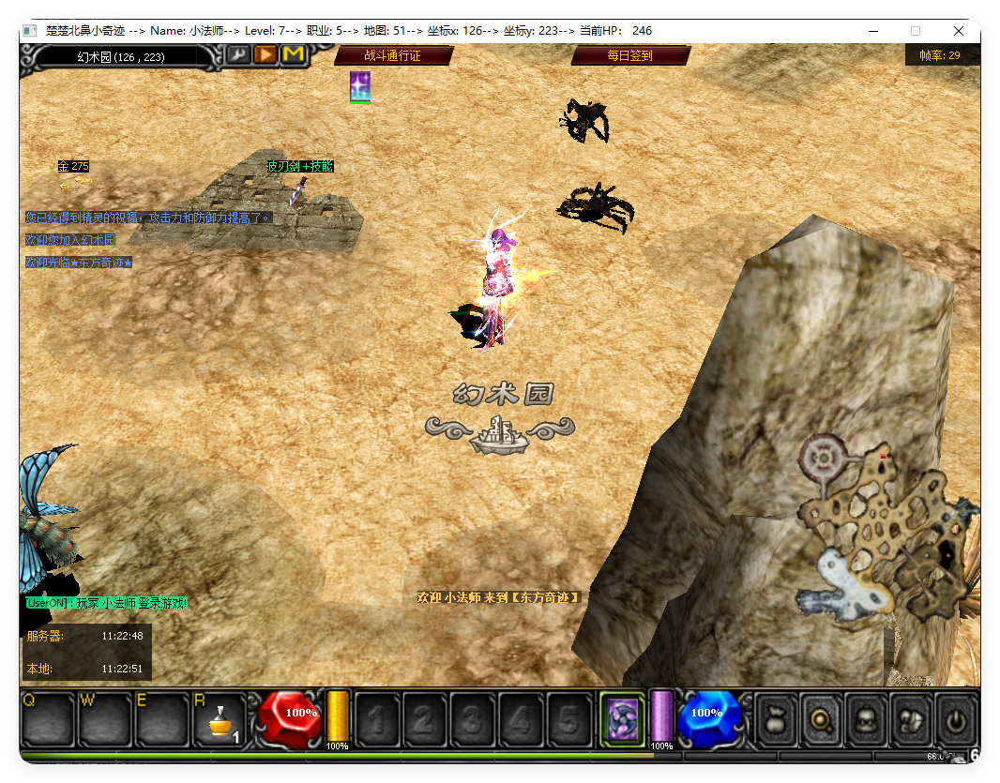

# AFK Detection System for Game Server

This Lua module implements an automatic AFK (Away From Keyboard) detection system for game servers. It monitors player activity and triggers visual and gameplay changes when a player becomes inactive.

## Features

- Detects inactivity based on keyboard and interface events
- Displays AFK status message and duration
- Locks player movement and enlarges character scale
- Restores state when player returns
- Fully customizable timeout threshold

## How It Works

- `AFK_TIMEOUT`: Time in seconds before AFK is triggered (default: 20)
- `reset_afk()`: Called on player input to reset AFK state
- `MainProcInterface()`: Runs every frame to check AFK status and render UI
- `CharacterSetScale()`: Enlarges character when AFK
- `LockPlayerWalk()`: Prevents movement during AFK
- `SendPlayerChat()`: Sends chat notifications

## Integration

Attach the following hooks in your game server environment:

```lua
function MainProcWorldKey(key)
    reset_afk()
end

function InterfaceClickRightEvent()
    reset_afk()
end

function MainProcInterface()
    -- AFK logic runs here
end

afk-system/
├── afk.lua           # Main AFK logic
├── README.md         # Project documentation
└── .gitignore        # Git ignore rules

## Customization
You can adjust the AFK timeout by changing:

AFK_TIMEOUT = 20  -- seconds

You can also modify the visual feedback, message format, or lock behavior to suit your game.

## License
This project is open-source and free to use under the MIT License.

 AFK UI 预览
<p align="center">

<br><em>AFK 状态提示界面</em>
</p>
<p align="center">

<br><em>角色放大与锁定效果</em>
</p>
<p align="center">

<br><em>AFK 时间显示与聊天通知</em>
</p>